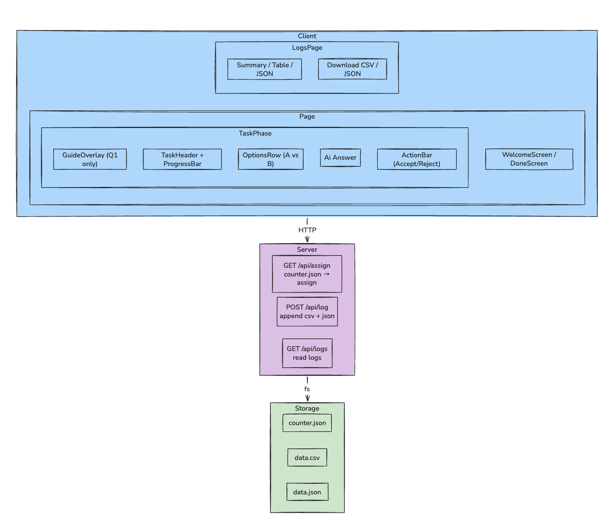

# AI Trust Study — GSoC Screening Prototype

**Project:** Humanlike AI Systems and Trust Attribution  
**Organization:** ISSR / University of Alabama  
**Applicant Submission** — Screening test prototype

---

## Table of Contents

1. [Overview](#overview)
2. [How to Run Locally](#how-to-run-locally)
3. [Current System Architecture](#current-system-architecture)
4. [Condition Logic — A/B Assignment](#condition-logic--ab-assignment)
5. [Logging Implementation](#logging-implementation)
6. [Logs Viewer](#logs-viewer)
7. [Sample Output](#sample-output)
8. [Component Architecture](#component-architecture)
9. [Architectural Design Decisions](#architectural-design-decisions)

---

## Overview

This prototype implements a **between-subjects A/B experiment** to measure how the *presentation* of an AI advisor (neutral vs. humanlike) affects a participant's trust and decision behavior.

**The single manipulated cue:**

| | Condition A (Neutral) | Condition B (Humanlike) |
|---|---|---|
| **Name** | `AI Assistant` | `Emma` |
| **Tone** | Formal, probability-based | Conversational, first-person |
| **Example** | *"74% of datasets confirm option A is faster."* | *"Hey! I'd definitely go with A — pretty sure it's the better call "* |

All other variables (question content, option order, layout) are held constant. This isolates the causal effect of **humanlike interface cues** on behavioral trust.

---

## How to Run Locally

```bash
cd my-app
npm install
npm run dev
```

Open **http://localhost:3000** in your browser.

| URL | Purpose |
|---|---|
| `http://localhost:3000` | Main experiment interface |
| `http://localhost:3000/logs` | Live log viewer (table + JSON) |

Logs are written automatically to `logs/data.csv` and `logs/data.json`. No database or external service required.

**Requirements:** Node.js 18+, npm 9+

---

## Current System Architecture



### Request / Data Flow

```text
1. Page load   → GET /api/assign
                   → reads counter.json
                   → assigns A or B (strict alternation)
                   → returns { participantId, condition }

2. Q1 appears  → GuideOverlay shown
                   → dismissed → qStart = Date.now()

3. User clicks → decide("accept" | "reject")
                   → latency_ms = Date.now() - qStart
                   → POST /api/log (Instant File-based fallback)
                       → written to CSV + JSON
                   → Event added to local memory array

4. All 20 done → POST /api/log-batch (Fire-and-forget DB write)
                   → Writes Session + 20 DecisionEvents to Neon DB
               → DoneScreen with summary stats
                   → link to /logs viewer
```

## Condition Logic — A/B Assignment

### Why Not Random?

With random assignment, small samples produce imbalanced groups. Strict alternation guarantees groups differ by at most 1 participant at any sample size.

### Server-Side Strict Alternation

```typescript
// src/app/api/assign/route.ts
let count = JSON.parse(fs.readFileSync(counterPath, "utf-8")).count ?? 0;

// Even → A, Odd → B  (guaranteed balance)
const condition: "A" | "B" = count % 2 === 0 ? "A" : "B";
const participantId = uuidv4();

fs.writeFileSync(counterPath, JSON.stringify({ count: count + 1 }));
return NextResponse.json({ participantId, condition });
```

The counter persists in `logs/counter.json` — it survives browser resets, multiple concurrent users, and server restarts.

---

## Database & Logging Implementation

### Database Schema (Neon + Prisma)

The system uses a relational PostgreSQL database hosted on Neon, managed via Prisma ORM.

```prisma
// One row per completed survey session
model Session {
  id             Int             @id @default(autoincrement())
  participant_id String          @unique
  condition      String          // "A" (neutral AI) | "B" (humanlike Emma)
  completed_at   DateTime        @default(now())
  events         DecisionEvent[]
}

// One row per question decision (20 per session)
model DecisionEvent {
  id             Int      @id @default(autoincrement())
  session        Session  @relation(fields: [participant_id], references: [participant_id])
  participant_id String
  condition      String   // Denormalized for rapid analytical queries
  question_id    Int
  decision       String   // "accept" | "reject"
  ai_correct     Boolean
  latency_ms     Int
  timestamp      DateTime
}
```

### Why Batch Logging? (Zero-Latency Strategy)
Writing to a remote cloud database during a high-resolution cognitive task can introduce blocking network latency (50ms–200ms+ per click). To guarantee the participant experiences **zero UI latency**, the architecture splits logging:
1. **Instant Feedback**: Individual decisions are locally cached in React state and fire-and-forgotten to local CSV/JSON.
2. **Batch Upload**: When the last question is answered, the entire array of  events is sent to `/api/log-batch` as a single fire-and-forget HTTP request. The user is instantly shown the "Done" screen while the server safely executes the Prisma transaction in the background.

### Event Schema (CSV/JSON Fallback)

| Field | Type | Description |
|---|---|---|
| `participant_id` | UUID | Unique per session, server-assigned |
| `condition` | `"A"` \| `"B"` | Which cue condition the participant saw |
| `question_id` | integer | 1–20 |
| `decision` | `"accept"` \| `"reject"` | Did the participant follow the AI? |
| `ai_correct` | boolean | Was the AI's recommendation actually correct? |
| `timestamp` | ISO 8601 | UTC wall-clock time |
| `latency_ms` | integer | Milliseconds from question display to click |

### Latency Measurement

`qStart = Date.now()` is set exactly when a question becomes interactive (after guide dismissal on Q1, immediately on Q2+). `latency_ms = Date.now() - qStart` captures **pure decision time** only.

---

## Logs Viewer

The prototype features a built-in research dashboard at `http://localhost:3000/logs`.

### Key Features:
- **Dual View**: Switch between a clean **Table View** and a raw **JSON Viewer**.
- **Interactive Filters**: Filter sessions by Condition (A/B), Decision (Accept/Reject), or Highlight type.
- **Behavioral Highlighting**: Rows are automatically color-coded to identify:
  -  **Overtrust**: AI was wrong, but participant accepted.
  -  **Undertrust**: AI was correct, but participant rejected.
- **One-Click Exports**: Dedicated buttons to download the full dataset as `data.csv` or `data.json`.
- **Live Stats**: Summary bar showing total decisions, unique participants, and per-condition acceptance/latency rates.

---

## Sample Output

### `logs/data.csv`

```csv
participant_id,condition,question_id,decision,ai_correct,timestamp,latency_ms
b4c2a1e0-...,A,1,accept,true,2026-03-23T01:14:09.123Z,4821
b4c2a1e0-...,A,2,reject,false,2026-03-23T01:14:14.002Z,2341
f9d1839c-...,B,1,accept,true,2026-03-23T01:15:01.440Z,3102
f9d1839c-...,B,2,accept,false,2026-03-23T01:15:06.210Z,1890
```

### `logs/data.json`

```json
[
  {
    "participant_id": "b4c2a1e0-...",
    "condition": "A",
    "question_id": 1,
    "decision": "accept",
    "ai_correct": true,
    "timestamp": "2026-03-23T01:14:09.123Z",
    "latency_ms": 4821
  }
]
```

---

## Component Architecture

```
src/app/
├── page.tsx                  ← State orchestrator only (~130 lines)
├── globals.css               ← Design system tokens + all component styles
├── data/
│   └── questions.ts          ← 20 questions × 2 conditions (typed interface)
├── api/
│   ├── assign/route.ts       ← GET: balanced A/B assignment
│   ├── log/route.ts          ← POST: persist one decision event
│   └── logs/route.ts         ← GET: return all log data for the viewer
├── logs/
│   └── page.tsx              ← /logs viewer page (table + JSON + download)
└── components/
    ├── WelcomeScreen.tsx     ← Onboarding + instructions
    ├── DoneScreen.tsx        ← Completion stats + "View Logs" link
    ├── GuideOverlay.tsx      ← First-question 4-step modal
    ├── TaskHeader.tsx        ← Fixed header + progress bar + theme toggle
    ├── OptionsRow.tsx        ← Option A vs B comparison chips
    ├── AIBubble.tsx          ← AI advisor response card
    └── ActionBar.tsx         ← Accept / Reject buttons
```

### Question Schema

```typescript
interface Question {
  id: number;
  scenario: string;           // Decision scenario text
  optionA: string;            // Option A label
  optionB: string;            // Option B label
  recommendation: "A" | "B"; // Which option the AI recommends
  ai_correct: boolean;        // Ground-truth (for overtrust analysis)
  conditionA_msg: string;     // Formal/neutral AI message
  conditionB_msg: string;     // Conversational/humanlike Emma message
}
```

Adding a new condition (`C`) requires only: `conditionC_msg` field + one line in the display switch. The logging schema, assignment mechanism, and analysis pipeline change zero lines.

---

## Architectural Design Decisions

| Decision | Alternative | Why |
|---|---|---|
| Next.js App Router | Separate React + Express | Co-located API + UI, single deployment, TypeScript throughout |
| Neon Serverless DB | Local SQLite | Cloud-ready database scaling, zero-config connection pooling |
| Prisma + Node pg | DB-specific SDK / raw SQL | Type-safe queries, fast schema prototyping, seamless migration |
| Batch DB Logging | Per-click DB logging | Prevents remote DB network latency from blocking the user's UI during rapid tasks |
| Strict alternation | Random assignment | Guarantees ≤1 group difference at any N; critical for small samples |
| Dual CSV + JSON | JSON only | CSV opens directly in R/Excel/Python without any parsing step |
| Server-side counter | `localStorage` | Correct for multi-user sessions; survives browser resets and server restarts |

---

*Built with Next.js 16 · TypeScript · Prisma · Neon PostgreSQL · Vanilla CSS *